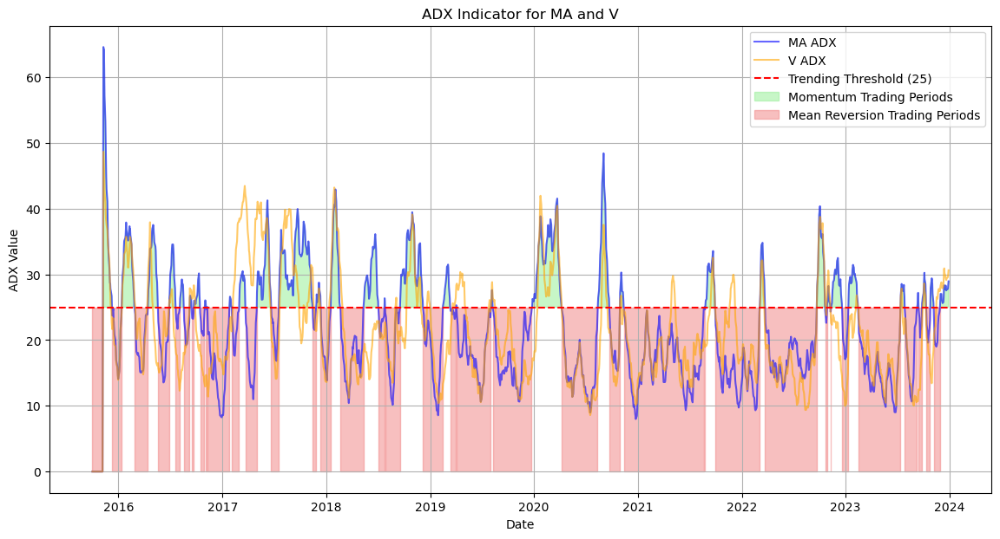

# Pairs Trading Strategy

This notebook was prepared for the Hedge Fund Club Mannheim as part of an exam for the Learning Sessions on quantitative trading strategies.

## Overview
The session develops a statistical arbitrage approach based on pairs trading:

1. **Data Collection & Preprocessing**  
   - Importing historical price data with `yfinance`.  
   - Preparing and aligning time series for candidate pairs.  

2. **Cointegration Analysis**  
   - Testing pairs for long-term equilibrium relationships.  
   - Constructing the spread and normalizing via z-scores.  

3. **Trading Logic**  
   - Entry and exit signals derived from spread deviations.  
   - Position sizing and risk management rules.  

4. **Performance Evaluation**  
   - Backtesting the strategy on historical data.  
   - Calculating cumulative returns and Sharpe ratios.  

5. **Regime Detection with ADX**  
   - Using the Average Directional Index (ADX) to classify trend strength.  
   - Adjusting the strategy to different market regimes.  

## Techniques
- Time series econometrics (cointegration testing).  
- Statistical arbitrage and spread construction.  
- Regime classification with ADX.  
- Backtesting and performance analysis.  

## Tools
- Python: NumPy, pandas, matplotlib, statsmodels, yfinance  

## Files
- `pairs_trading.ipynb`: Full implementation with explanations.  
- `requirements.txt`: Python dependencies.  

## Example Output
Here is an example ADX-based regime classification from the notebook:  

## Disclaimer
This project is for educational purposes only and not investment advice.
