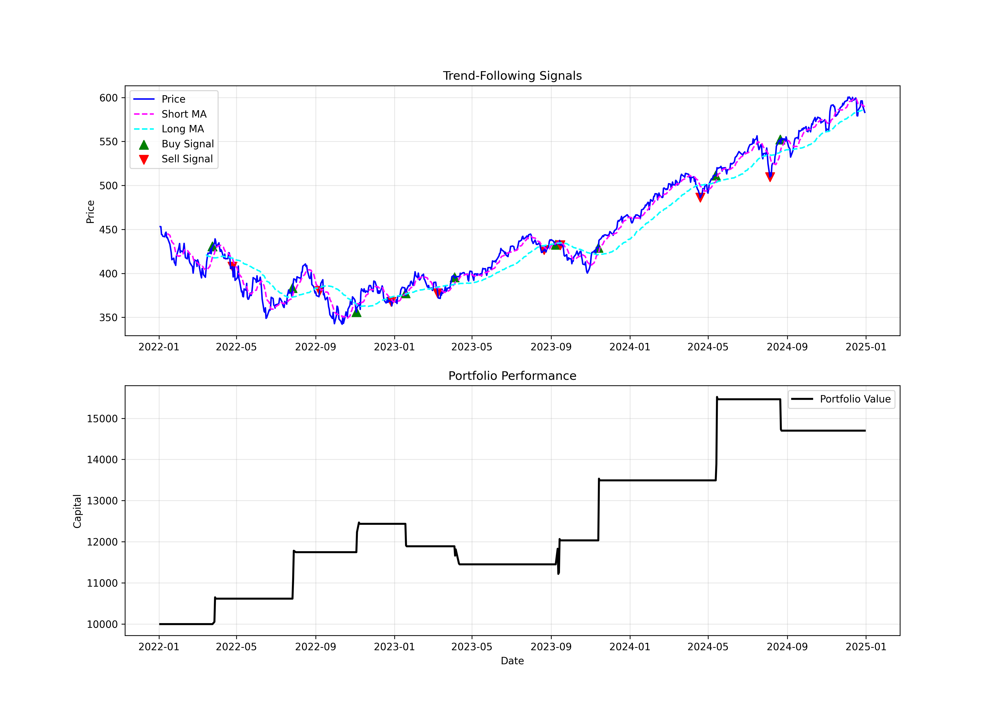

# Options-Based Trend-Following Strategy

This notebook was prepared for the Hedge Fund Club Mannheim as part of a learning session on options in practice.

## Overview
The session builds step by step towards an options-based trend-following strategy:

1. **Foundations: Black–Scholes Model**  
   - Implementation of the Black–Scholes formula for European option pricing.  
   - Visualization of payoff diagrams to illustrate option payoffs for calls and puts.  

2. **Event-Driven Option Pricing Strategies**  
   - **Simplified approach**: A basic strategy to show how option prices react to discrete events.  
   - **More realistic approach**: Incorporates more practical assumptions to approximate market conditions.  

3. **Options-Based Trend-Following Strategy**  
   - Applying trend filters to underlying assets and expressing positions through options.  
   - Backtesting, performance evaluation, and visualization of results.  

## Techniques
- Data preprocessing and feature engineering.  
- Option pricing and payoff visualization.  
- Backtesting and evaluation of trading strategies.  

## Tools
- Python: NumPy, pandas, matplotlib  
- Option pricing with Black–Scholes  

## Files
- `options_in_practice.ipynb`: Full implementation with explanations.  
- `requirements.txt`: Python dependencies.  

## Example Output
Here is an example equity curve from the backtest:  

## Disclaimer
This project is for educational purposes only and not investment advice.
